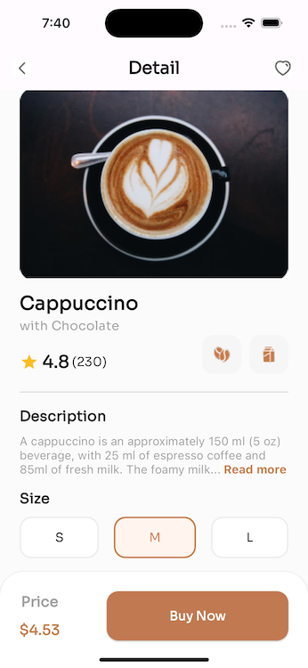

# Flutter Project - Cappucino
This is a Flutter screen that displays a cappuccino with chocolate Product. The screen includes the following elements:
-   The App bar that houses the back botton and love icon
-   The Product title, description, and ratings section
-   The Product size section where different sizes of the product can be picked
-   The Product bottom section where the price is shown, the price is dynamic based on the size picked.
- Sora font from Google fonts wwas added to the text

## To run this app:
-   Clone the repository to your local machine.
-   Open the project in a code editor.
-   Run the app using the flutter run command.

## Screenshot

